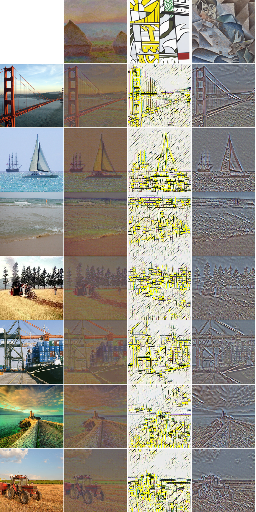

# A Learned Representation For Artistic Style

Chosen paper: [A Learned Representation For Artistic Style](https://openreview.net/forum?id=BJO-BuT1g)

## Abstract

Style transfer is the transfer of the high level features of one image to another, often used to apply the artistic styles of pieces of art to normal images. This report aims to reproduce the findings of Dumoulin et al. (2016) – that multiple styles can be represented with a single neural network, that said network can have new styles added to it post training, and finally that this network can be used to arbitrarily mix different styles onto a single image. The report shows that all of these results are reproducable, however is not successful in reproducing them to the same level of quality as the original paper.

### Requirements

For the requirements for the python notebook to run, see [requirements.txt](requirements.txt).

### File structure

```
.
├── code
├── wiki
├── validation
│   ├── pretty
│   │   └── images
│   ├── train
│   │   └── images
│   └── val
│       └── images
└── weights
```

* code contains the main python notebook used with [Colab](https://colab.research.google.com)
* wiki contains our report and the images used within this README
* validation needs to contain the images used for training the network
	- `pretty/images` is used for run-by-run comparison
	- `train/images` contains training images
	- `val/images` contains validation images
* weights contains the outputted pre-trained weights that we have generated.

Note, the images to be used must be within `/validation/<group>/images/`. 

---

## Results 

### Style Transfer
This project trained the custom network from scratch on ten styles. These were Monet styles as done in the paper.

Five of the styles are shown in the image (accross the top) against our seven test images (down the left side).


#### Our Training Weights

Our training weights can be found [here](weights/stylemodel.weights).

---

### Adding New Styles

Any number of styles can be added to a pre-trained network. We have added two new styles to the original ten.
These are Roy Lichtenstein,Bicentennial Printand and Juan Gris’Portrait of Pablo Picasso.

These can be seen below.



#### Our Training Weights

Our training weights from adding the new styles can be found [here](weights/stylemodel_added.weights).

---

### Mixing Styles

Mixing styles can be achieved between two or more images. 

Shown below is an example of mixing using the paintings Roy Lichtenstein,Bicentennial Printand and Claude Monet,Grainstacks at Giverny; the Evening Sun.
The first image shows the original un-stylised image.


